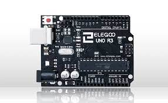
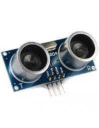
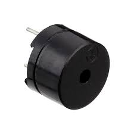
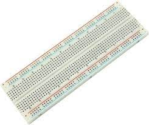
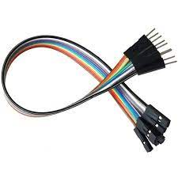
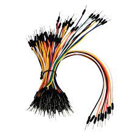
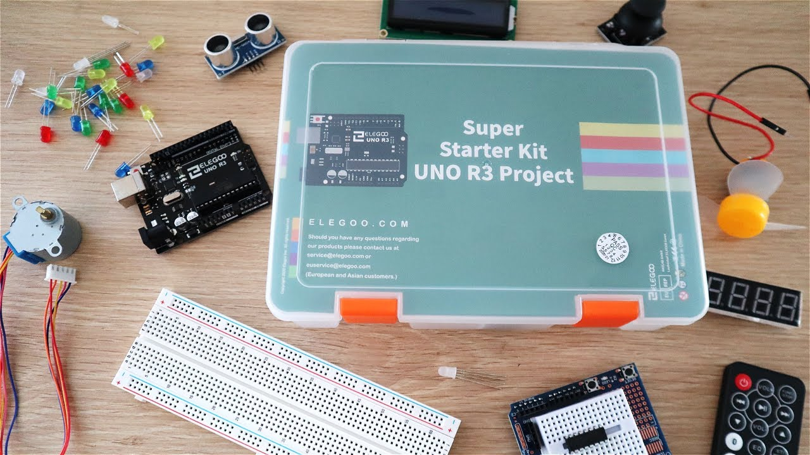
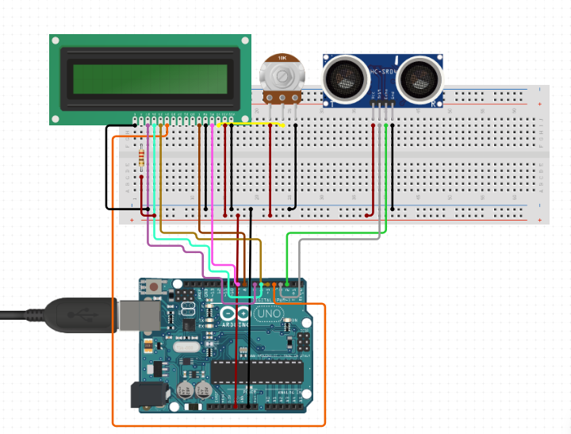

# Digital Clock with a Proximity Alarm

**Student**: Adilet Baimyrza Uulu

**Course**: L-22/23 Microcontrollers Programming

## Introduction

This is the project I have done for the Microcontrollers Programming course, in attempts to learn the basics of working with and programming microcontrollers.

The Digital Clock with a Proximity Alarm project utilizes an Arduino Uno microcontroller, a Real Time Clock (RTC) module for timekeeping, an LCD1602 display for visual feedback, and a passive buzzer to play a selection of melodies as alarms. Users have the flexibility to customize the alarm time and choose from a variety of melodies, including iconic tunes such as the Game of Thrones theme song and the Harry Potter theme song.

## How does it work?

The digital clock I've built for this project functions just like a traditional digital clock. It features a display that provides users with real-time information, including the current time, date, and day of the week. Additionally, it allows users to set a custom alarm time by modifying the C++ code in the Arduino IDE. Furthermore, users have the option to select from a range of melodies for the alarm, such as the Game of Thrones theme song, the Harry Potter theme song, the Pirates of the Caribbean theme song, or even the Nokia Ringtone.

What sets this digital clock apart is its unique alarm deactivation method. To turn off the alarm, you need to approach the clock closely. It utilizes a distance sensor that detects your proximity and automatically silences the alarm when you get close enough.

## Parts Needed

1. **LCD1602 Display Module (with pin header)** - 1 piece (to display the clock data)
   

2. **UNO R3 Controller Board** - 1 piece (microcontroller itself)
   

3. **Ultrasonic Sensor** - 1 piece (to detect the distance)
   

4. **Passive Buzzer** - 1 piece (to play alarm melodies)
   

5. **Potentiometer 10K** - 1 piece (to adjust the brightness of the display)
   

6. **830 Tie-Points Breadboard** - 1 piece
   

7. **Arduino Uno USB Cable** - 1 piece (to connect the microcontroller to the laptop)
   

8. **Real Time Clock RTC DS3231** - 1 piece (to keep track of time)
   

9. **Female-To-Male Dupont Wire** - 4 pieces
   

10. **Breadboard Jumpers** - as needed
    

These are the components that come from the Super Starter Kit UNO R3 Project that I bought from Amazon for ~200 PLN, except for the eighth position (Real Time Clock RTC DS3231). This piece I bought from the AZ-Delivery supplier from Amazon as well (~20 PLN).

*Very useful kit. You will have almost anything to get started with Arduino. And depending on your next project, you can buy the lacking components anywhere on the internet for a decent price.*

## Electronics Assembly

If you connect all the components together, you would end up with a scheme that is similar to the one below. There are a lot of resources on the internet on how to connect the components, all of them have minor differences but the logic is the same. Some of them use transistors as shown in the figure below, mine doesn't have.

## Programming

At this point, you are almost good to go. The only thing that matters now is coding. You are going to need to install the latest version of Arduino IDE from their website. Follow the instructions and copy the code from the repository: 

[GitHub Repository](https://github.com/AdiletBaimyrza/clock-with-alarm-arduino-project/main.ino)

As long as you do it, you just have to upload the code to the microcontroller, and that's it. Thank you for your attention.

[Link to the Video of how it works](https://www.youtube.com/watch?v=deZLTGdRmBk)
